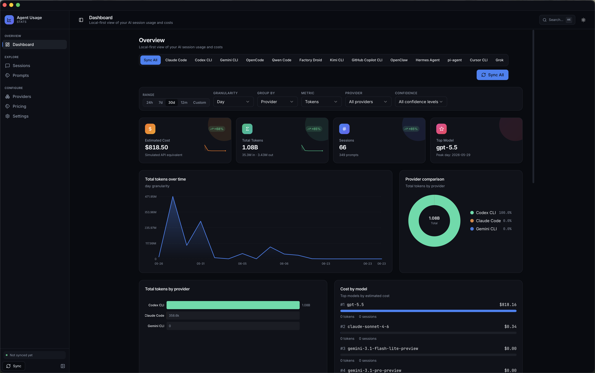
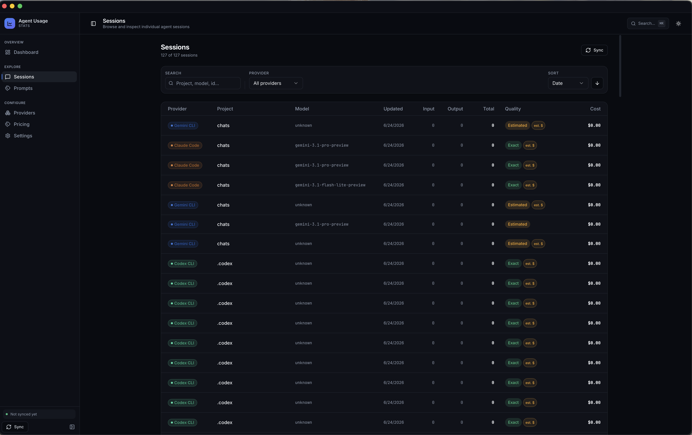

# Agent Usage Stats

Local-first usage analyzer for **20 AI coding agents** — Claude Code, Codex, Gemini, OpenCode, GitHub Copilot CLI, Qwen, Goose, and more. Discover your session files, normalize their wildly different token formats into one SQLite database, estimate API-equivalent costs, and explore everything from a CLI, a web dashboard, or a native desktop app.

**Your data never leaves your machine.** No telemetry, no cloud, no network calls at runtime.

[](https://opensource.org/licenses/MIT)
[](https://nodejs.org)
[](https://pnpm.io)

---

## Screenshots

### Dashboard

Time range, granularity, group-by, and confidence filters over every provider — with cost, tokens, sessions, top-model cards, a tokens-over-time chart, provider comparison, and cost-by-model breakdown.



### Sessions

Every ingested session with provider, project, model, token totals, a **quality badge** (exact vs estimated), and per-session cost — searchable and sortable.



---

## Why this exists

Every coding agent records usage differently — Claude writes per-message JSONL with cache tokens, Codex emits `token_count` events, Goose and Kilo keep SQLite databases, Copilot only writes OpenTelemetry traces if you enable them, and Aider just keeps a markdown chat log with no token data at all. Agent Usage Stats reads all of them, normalizes the data into a single schema, and gives you one place to answer: *how much am I actually using these tools, and what would it cost on metered APIs?*

## Features

- **Provider Registry** — 20 agents defined in one table; detection, CLI, web UI, and config schemas are all derived from it (no duplicated provider lists)
- **Session Discovery** — Auto-discovers session files using glob patterns with `~` and `$ENV` expansion, honoring per-provider env overrides
- **Token Tracking** — Input, output, cached, reasoning, and cache-creation tokens wherever the provider exposes them
- **Honest Confidence Model** — Every session is tagged `exact`, `cumulative-delta`, `provider-recorded-cost`, `estimated-from-text`, `metadata-only`, or `unavailable` — estimates are never silently presented as facts
- **Cost Estimation** — Simulated API-equivalent costs from a bundled pricing snapshot + your editable pricing table; estimated rows are clearly flagged
- **Full-Text Search** — SQLite FTS5 over stored prompts (with a `LIKE` fallback)
- **Privacy Controls** — Four privacy modes; fresh installs store **zero** prompt content
- **Schema Inspection** — Read-only `inspect-schema` for SQLite-backed providers; never writes to source databases
- **Web Dashboard** — Charts, sessions, prompts, pricing editor, provider status, settings
- **CLI Tool** — Full command set with `--json` on every command for scripting, plus a GitHub-style `activity` calendar
- **Desktop App** — Native Tauri v2 app with custom titlebar, menu bar, system tray, and auto-scan
- **Local-First** — All data stays on your machine; dashboard binds to `127.0.0.1` only

---

## Supported Providers

Every provider is defined in **`packages/shared/src/providers.ts`** — the single source of truth. The table below reflects current parser support, default usage confidence, and storage format.

**Support levels:** `exact-usage` · `partial-usage` · `prompt-history-only` · `detected-only`

**Usage confidence** (per session): `exact` · `cumulative-delta` · `provider-recorded-cost` · `estimated-from-text` · `metadata-only` · `unavailable`

| Provider | Parser | Support | Default confidence | Storage | Default path / env |
|----------|:------:|---------|--------------------|---------|--------------------|
| Claude Code | ✅ | exact-usage | exact | jsonl | `~/.claude/projects/**/*.jsonl` · `$CLAUDE_CONFIG_DIR` |
| Codex CLI | ✅ | exact-usage | exact | jsonl/json | `~/.codex` · `$CODEX_HOME` |
| Gemini CLI | ✅ | partial-usage | estimated-from-text | json | `~/.gemini/tmp/**/chats/**/*` · `$GEMINI_DATA_DIR` |
| OpenCode | ✅ | partial-usage | exact | sqlite/json | `~/.local/share/opencode` · `$OPENCODE_DATA_DIR` |
| Qwen Code | ✅ | exact-usage | exact | jsonl | `~/.qwen` · `$QWEN_DATA_DIR` |
| Goose | ✅ | exact-usage | exact | sqlite | `~/.local/share/goose` · `$GOOSE_PATH_ROOT` |
| Factory Droid | ✅ | exact-usage | exact | json | `~/.factory` · `$DROID_SESSIONS_DIR` |
| Amp | ✅ | exact-usage | exact | json | `~/.local/share/amp` · `$AMP_DATA_DIR` |
| Codebuff | ✅ | partial-usage | exact | json | `~/.config/manicode` · `$CODEBUFF_DATA_DIR` |
| Kimi CLI | ✅ | exact-usage | exact | jsonl | `~/.kimi` · `$KIMI_DATA_DIR` |
| GitHub Copilot CLI | ✅ | exact-usage | exact | otel | `~/.copilot/otel` · `$COPILOT_OTEL_FILE_EXPORTER_PATH` |
| OpenClaw | ✅ | partial-usage | provider-recorded-cost | jsonl | `~/.openclaw` · `$OPENCLAW_DIR` |
| Hermes Agent | ✅ | exact-usage | provider-recorded-cost | sqlite | `~/.hermes` · `$HERMES_HOME` |
| pi-agent | ✅ | partial-usage | exact | jsonl/json | `~/.pi/agent` · `$PI_AGENT_DIR` |
| Kilo | ✅ | exact-usage | provider-recorded-cost | sqlite | `~/.local/share/kilo` · `$KILO_DATA_DIR` |
| Aider | ✅ | prompt-history-only | metadata-only | markdown | `**/.aider.chat.history.md` |
| Cursor CLI | ✅ | prompt-history-only | metadata-only | sqlite/markdown | `~/.cursor` · `$CURSOR_DATA_DIR` |
| SpecStory | ✅ | prompt-history-only | metadata-only | markdown | `**/.specstory/history/**/*.md` |
| Grok | ✅ | prompt-history-only | metadata-only | json | `~/.grok/sessions/**/signals.json` · `$GROK_DATA_DIR` |
| Crush | ⚠️ detect only | detected-only | unavailable | json | `~/.config/crush/crush.json` |

> Run `agent-usage providers` (or `agent-usage providers detect --json`) to see which agents are installed on your machine.

### Prompt-history-only providers

**Aider**, **Cursor CLI**, **SpecStory**, and **Grok** store conversation metadata but do not expose a reliable input/output token split or cost. By default the app **never invents token counts** for these sources — their sessions appear as `metadata-only` in stats and the dashboard.

> **Grok** exposes only aggregate context-window counts in its local `signals.json` (no input/output split, no cost), which is why it is treated as prompt-history-only.

To enable optional, rough text-based token estimation (clearly flagged as `estimated-from-text`), set in `agent-usage.config.json`:

```json
{ "estimatePromptOnlySources": true }
```

These providers are **disabled by default** in the example config because their session files often contain raw prompt text; enable them explicitly when you want ingestion.

### GitHub Copilot CLI (OpenTelemetry)

Copilot does not write usage files unless OpenTelemetry export is enabled. Before running sessions:

```bash
export COPILOT_OTEL_ENABLED=true
export COPILOT_OTEL_EXPORTER_TYPE=file
export COPILOT_OTEL_FILE_EXPORTER_PATH=~/.copilot/otel/usage.jsonl
```

Then run `agent-usage doctor --provider copilot` for setup guidance, or `agent-usage scan --provider copilot`.

### Schema inspection (SQLite providers)

Explore any SQLite-backed provider database **read-only** before writing parsers or debugging — the command never modifies the source database and flags likely usage tables:

```bash
agent-usage inspect-schema --provider opencode
agent-usage inspect-schema --provider goose --json
agent-usage inspect-schema --provider kilo --file /path/to/kilo.db
agent-usage inspect-schema --provider hermes
```

---

## Quick Start

### Prerequisites

- **Node.js 20+**
- **pnpm 9+**

### Install & run (git checkout)

```bash
git clone https://github.com/gega-dkv/agent-usage-stats.git
cd agent-usage-stats
pnpm install
pnpm build          # builds packages, bundles web into the CLI, then builds the CLI
pnpm dev            # web dashboard at http://127.0.0.1:3000
```

`pnpm build` runs packages **in explicit dependency order** (`shared → pricing → db → parsers → ui → core → web → cli`), copies the built Next.js app into `apps/cli/web`, then builds the CLI so `agent-usage dashboard` can serve the bundled UI offline.

### Global CLI

```bash
pnpm link --global --filter @agent-usage/cli
# or, once published:
npm install -g @agent-usage/cli
```

Then from any directory:

```bash
agent-usage sync         # detect installed agents and ingest their sessions
agent-usage dashboard    # bundled web UI on http://127.0.0.1:3000
```

See [`apps/cli/README.md`](apps/cli/README.md) for package layout.

### Homebrew (macOS, template)

No official tap yet. A formula template is included for local or third-party taps:

```bash
pnpm build
brew install --build-from-source ./Formula/agent-usage.rb
```

Details: [`docs/HOMEBREW.md`](docs/HOMEBREW.md).

### Desktop app (Tauri v2)

A native, local-first desktop app with a purpose-built Vite + React SPA frontend and a localhost Node sidecar for data — **localhost only, no public server**. Requires Rust and platform SDKs.

```bash
pnpm build
pnpm desktop:dev      # Tauri window; SPA + CLI sidecar on http://127.0.0.1:3847
pnpm desktop:build    # native bundle (.app / .deb / .AppImage / .msi)
```

Native affordances: custom titlebar, native menu bar (Rescan ⌘R, Toggle Theme, Reload), system tray, a boot screen that surfaces sidecar logs, and an auto-scan on launch. Full setup, architecture, and troubleshooting live in [`apps/desktop/README.md`](apps/desktop/README.md).

> **Distribution note:** release builds still invoke a local `node` for the data layer, so shipping a fully self-contained installer (bundled Node + CLI) is not yet implemented.

### Platform notes

- **macOS** — primary development and path-verification platform
- **Linux** — app DB at `$XDG_CONFIG_HOME/agent-usage-stats/stats.db`; provider paths honor `$ENV` overrides
- **Windows** — `%USERPROFILE%` / `%APPDATA%` expansion; run `agent-usage doctor` to validate paths

---

## CLI Usage

Every command supports `--json` for scripting. Replace `pnpm cli` with `agent-usage` when globally installed.

### Scanning and sync

```bash
pnpm cli sync                          # detect agents, interactive or auto-select
pnpm cli sync --agent claude --json
pnpm cli sync --agent all --path ~/custom/sessions

pnpm cli scan                          # scan all enabled providers
pnpm cli scan --provider claude
pnpm cli history --json                # recent scan runs
pnpm cli warnings --json               # parser warnings from recent scans
```

### Stats, activity, and export

```bash
pnpm cli stats                         # summary
pnpm cli stats --day
pnpm cli stats --week --from 2026-01-01 --to 2026-06-30
pnpm cli stats --month --year --json
pnpm cli stats --granularity week

pnpm cli activity                      # GitHub-style usage calendar (last 26 weeks)
pnpm cli activity --weeks 52 --metric cost --provider claude
pnpm cli activity --metric sessions --json

pnpm cli stats export --day --format csv -o usage.csv
pnpm cli sessions export --format json -o sessions.json
```

### Prompts

```bash
pnpm cli prompts                       # requires a privacy mode that stores content
pnpm cli prompts --search "refactor auth"
```

### Providers and health

```bash
pnpm cli providers
pnpm cli providers detect --json
pnpm cli doctor
pnpm cli doctor --provider copilot --json
pnpm cli inspect-schema --provider opencode --json
```

### Dashboard, watch, privacy, pricing

```bash
pnpm cli dashboard                     # serves bundled web UI
pnpm cli dashboard --json              # { url, port, pid }
pnpm cli dashboard --port 3001 --no-open

pnpm cli watch                         # re-scan on session-file changes
pnpm cli watch --provider claude --json

pnpm cli privacy status
pnpm cli privacy set full
pnpm cli privacy purge-content         # permanently delete stored prompt text

pnpm cli pricing list
pnpm cli pricing import pricing.example.json
pnpm cli pricing export -o my-pricing.json
```

---

## How it works

### The scan pipeline

`scanSessions` in `packages/core/src/scan.ts`:

1. **Discover** — `discoverSessionFiles` globs session files using the registry's default paths (or your configured overrides).
2. **Pick a parser** — `getParserForFile` chooses a parser via `canParse(filePath, sample)` on the first ~4 KB of each file.
3. **Parse** — the parser returns normalized sessions + warnings, gated by `privacyMode` and `estimatePromptOnlySources`.
4. **Persist** — sessions/messages are upserted into SQLite; costs are computed via `lookupPricing` + `calculateCost`.
5. **Roll up** — `usage_daily` / `usage_monthly` / `usage_yearly` tables are rebuilt **once, at the end of the scan**.

```
discover → parse (privacy-gated) → upsert SQLite → compute costs → refresh rollups
```

### `sync`

Detects installed agents via the provider registry, lets you choose which to ingest, and scans each.

| Mode | Behavior |
|------|----------|
| Interactive (TTY) | Lists detected agents; prompts when multiple are installed |
| Non-TTY / piped | Auto-selects the first installed agent, or all with `--agent all` |
| `--json` | Skips prompts; returns `{ agents, selectedProviders, filesScanned, … }` |
| `--agent` / `--provider` | Limit to one provider, or `all` |
| `--path` | Include custom paths in the scan |

### `watch`

Watches default provider session paths and re-scans on changes.

- **Debounce:** 500 ms after the last event; chokidar `awaitWriteFinish` waits 1 s for writes to settle
- **`--json` events:** `watch_started`, `file_changed`, `scan_complete` (includes scan stats)

---

## Web App

### Development

```bash
pnpm dev    # http://127.0.0.1:3000
```

### From the CLI (production build)

```bash
pnpm build
pnpm cli dashboard    # or: agent-usage dashboard
```

Serves the bundled Next.js app from `apps/cli/web`, bound to **127.0.0.1** only. SQLite access is server-only (`apps/web/src/lib/db-server.ts` lazy-imports the DB and core packages); the browser only ever talks to `/api/*` routes.

### Pages

| Page | Purpose |
|------|---------|
| **Dashboard** | Time range, granularity, group-by, metric & confidence filters; cost/tokens/sessions/top-model cards; tokens-over-time, provider comparison, and cost-by-model charts |
| **Sessions** | Searchable, sortable list; detail timeline with tool calls and parser warnings |
| **Prompts** | Paginated list with filters and a privacy toggle; metadata-only messaging for prompt-history providers |
| **Pricing** | Edit rates, switch profiles (`api-standard`, `subscription-equivalent`), import/export |
| **Providers** | Detection status, support level, recent warnings, exact vs metadata-only counts |
| **Settings** | Provider toggles/paths, privacy mode, estimation fallback, rescan, rebuild rollups |

First visit: run **Scan** from Settings (or `agent-usage sync`) to populate the database.

---

## Configuration

Copy `agent-usage.config.example.json` to your project root (or home directory). It is merged over `getDefaultConfig()`.

| Field | Description |
|-------|-------------|
| `privacyMode` | `disabled` (default), `preview`, `full`, or `raw` |
| `currency` | Display currency for costs (default `USD`) |
| `estimatePromptOnlySources` | Allow rough token estimation for Aider/Cursor/SpecStory/Grok (default `false`) |
| `resimulateRecordedCosts` | Recompute costs from the pricing table even when a provider recorded a cost |
| `modelAliases` | Map session model names to canonical pricing-table entries |
| `customPaths` | Extra glob paths to include in every scan |
| `providers` | Per-provider `enabled` flag and optional `paths` overrides |
| `storeRawRecords` | Persist raw parser records for debugging (default `false`) |

**Database location:** `config.dbPath` → `AGENT_USAGE_DB_PATH` → `~/.config/agent-usage-stats/stats.db`.

**Schema:** existing databases upgrade automatically via migrations (current `schema_version` is **3**). Run `agent-usage doctor` to see the current version.

### Privacy modes

| Mode | Stored content |
|------|----------------|
| `disabled` | Token/cost metadata only; **no prompt text** (default) |
| `preview` | Short, redacted previews |
| `full` | Full prompt/response text |
| `raw` | Full raw records (debugging) |

Changing the privacy mode affects **future scans** only unless you rescan. Use `privacy purge-content` to permanently delete stored text and its FTS index entries.

---

## Pricing

Costs are **simulated API-equivalent estimates** from a local bundled snapshot plus your editable SQLite pricing table — **never fetched from the internet at runtime**. They are not billed amounts and are not reconciled against provider invoices.

```bash
pnpm cli pricing export > pricing.json
pnpm cli pricing import pricing.example.json
```

Import accepts an array of models or `{ "models": [...], "modelAliases": {...} }` (see `pricing.example.json`).

**Model aliases** resolve names like `anthropic/claude-sonnet-4` or `openrouter/google/gemini-2.5-pro` to canonical pricing rows. Bundled aliases cover OpenAI/Codex, Anthropic, Gemini/Vertex/OpenRouter, Qwen, and Moonshot/Kimi. Override them in config:

```json
{
  "modelAliases": {
    "my-internal-codename": "gpt-4o",
    "team-claude-alias": {
      "target": "claude-sonnet-4-20250514",
      "provider": "anthropic"
    }
  }
}
```

Unknown models fall back to the provider default with **`cost_estimated: true`**.

**Profiles:** `api-standard` (on-demand list prices, default) vs `subscription-equivalent` (compare against flat tiers like ChatGPT Plus — edit per-token rates in the web UI).

---

## Privacy & Security

- **Local-first** — Session files and the SQLite DB never leave your machine
- **No telemetry** — Zero network requests at runtime; the dashboard binds to localhost
- **Read-only provider DBs** — SQLite sources are opened read-only; `inspect-schema` never writes
- **Configurable retention** — Privacy modes control prompt/response/raw storage
- **Purging** — `privacy purge-content` removes message content, FTS index entries, and related metadata
- **Estimation transparency** — Estimated tokens/costs are flagged in CLI JSON, web sessions, and the stats summary
- **Default-safe** — A fresh install stores no prompt content (`privacyMode: disabled`)

---

## Architecture

pnpm monorepo. Apps live in `apps/`, libraries in `packages/`. Every workspace package is published as `@agent-usage/<name>`. Source is ESM TypeScript — **relative imports use `.js` extensions**.

```
agent-usage-stats/
├── apps/
│   ├── cli/           # CLI (commander) + bundled web/ after build
│   ├── web/           # Next.js App Router dashboard
│   └── desktop/       # Tauri v2 app (Vite + React SPA + Node sidecar)
├── packages/
│   ├── core/          # Scan engine (scanSessions)
│   ├── db/            # SQLite (better-sqlite3 + Drizzle), FTS5, migrations
│   ├── parsers/       # File discovery + one parser per provider
│   ├── pricing/       # Cost engine + model aliases
│   ├── shared/        # Types, Zod schemas, PROVIDER_REGISTRY
│   └── ui/            # Chart components shared by web + desktop
└── Formula/           # Homebrew template
```

| Package | Responsibility |
|---------|----------------|
| `@agent-usage/shared` | Canonical types (`NormalizedSession`, `NormalizedMessage`, `TokenTotals`) and the provider registry |
| `@agent-usage/parsers` | File discovery (`~`/`$ENV` expansion) and one parser per provider |
| `@agent-usage/core` | The scan pipeline orchestration |
| `@agent-usage/db` | SQLite schema, migrations, and query helpers |
| `@agent-usage/pricing` | Pricing lookup, cost calculation, and alias resolution |
| `@agent-usage/ui` | SVG charts reused by the web and desktop frontends |

---

## Development

```bash
pnpm install
pnpm test:run        # Vitest across workspaces
pnpm typecheck       # tsc --noEmit
pnpm build
pnpm lint            # ESLint over apps/** and packages/**
pnpm format          # Prettier
```

Run a single test file or filter by name:

```bash
pnpm test:run packages/parsers/tests/parsers.test.ts
pnpm test:run -t "claude parser"
```

See [`CONTRIBUTING.md`](CONTRIBUTING.md) for parser fixtures, schema-change rules, and PR guidelines, and [`AGENTS.md`](AGENTS.md) for commit/testing/style conventions.

### Adding a new provider

1. **Register** an entry in `PROVIDER_REGISTRY` (`packages/shared/src/providers.ts`) and add the id to the `Provider` union in `types.ts`.
2. **Implement** a parser in `packages/parsers/src/<provider>.ts` and register it in `packages/parsers/src/index.ts`.
3. **Add fixtures + tests** under `packages/parsers/tests/fixtures/<provider>/`.
4. **Update** `agent-usage.config.example.json`.

```typescript
import type { ProviderParser } from '@agent-usage/shared';

export const myParser: ProviderParser = {
  provider: 'myprovider',
  canParse(filePath: string, sample: string): boolean {
    return filePath.endsWith('.jsonl') && sample.includes('"usage"');
  },
  async parse(filePath, options) {
    return { sessions: [], warnings: [] };
  },
};
```

For SQLite-backed agents, run `agent-usage inspect-schema --provider <id>` first to map the database before writing the parser.

---

## License

[MIT](https://opensource.org/licenses/MIT)
</content>
</invoke>
